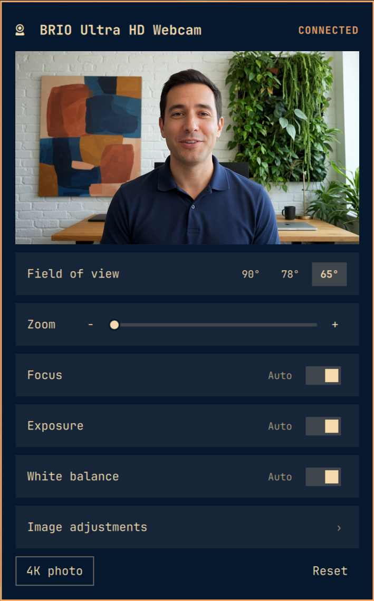
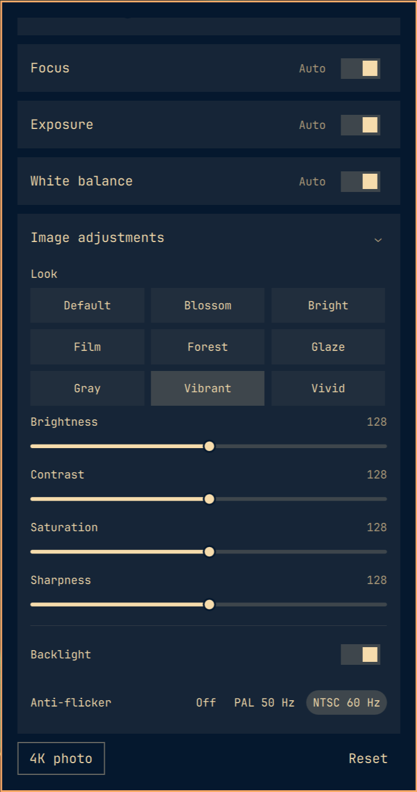

# BrioTune

Logi Tune-style controls for a Logitech Brio, on the Omarchy bar.

 

Plugin id: `io.github.shawnyeager.briotune`.

## Install

```sh
omarchy plugin add https://github.com/shawnyeager/briotune.git --enable
```

You need `v4l2-ctl` (from `v4l-utils`) and `python3`. 4K photos need
`ffmpeg`. CLI preview needs `mpv` or `ffplay`.

Move the widget with:

```sh
omarchy bar move io.github.shawnyeager.briotune --section right
```

## Usage

Click the webcam icon to open the panel. Escape closes it. Right-click
refreshes.

Scroll the preview to zoom. Drag to pan when zoomed.

The recording lamp, IR view, and dynamic framerate are `bin/brio-ctl`
commands.

## CLI

```sh
bin/brio-ctl status
bin/brio-ctl set fov=78
bin/brio-ctl set look=vivid
bin/brio-ctl set led=on
bin/brio-ctl snapshot
bin/brio-ctl reset
```

`brio-ctl --help` lists the rest. This plugin is written for BRIO Ultra
4K, USB `046d:085e`. If you have another Brio, open an issue or PR with
the USB id and a `brio-ctl status` dump.

## Remove

```sh
omarchy plugin remove io.github.shawnyeager.briotune
```

## License

MIT. See [LICENSE](LICENSE).

## Disclaimer

BrioTune is an independent project. It is not affiliated with, endorsed by,
or sponsored by Logitech International S.A., Logi, or any of their
subsidiaries.

Logitech, Logi, Logi Tune, Brio, and related names are trademarks of their
respective owners. Those names appear here for identification only.

The software is provided "as is", without warranty of any kind. You run it
on your own camera and desktop. See [LICENSE](LICENSE).

Omarchy plugins share the long-running Omarchy shell process. They run
unsandboxed with your user permissions. Read the code before you install
it from a git URL.
